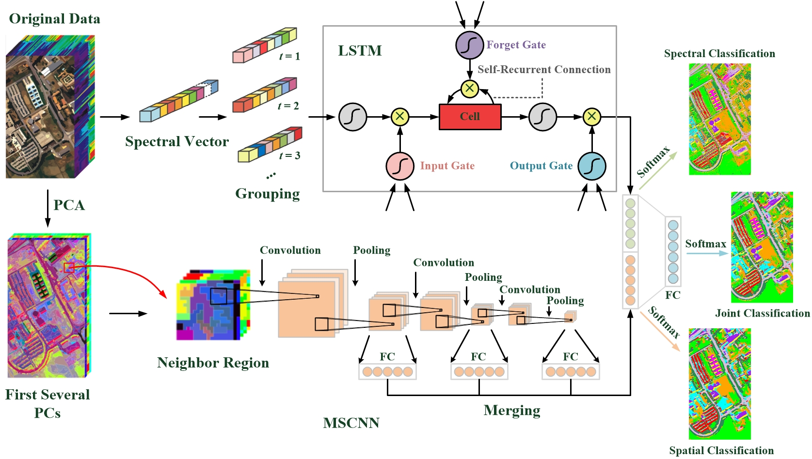
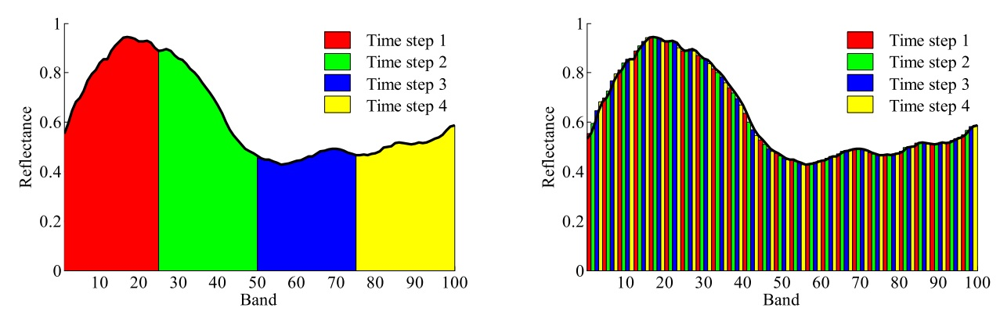

# Spectral-Spatial Unified Networks for Hyperspectral Image Classification

Keras implementation of our method for hyperspectral image classification.



## Paper
[Spectral–Spatial Unified Networks for Hyperspectral Image Classification](https://ieeexplore.ieee.org/document/8356713)

Please cite our papers if you find it useful for your research.

```
@article{ssun,
  author={Y. Xu and L. Zhang and B. Du and F. Zhang},
  journal={IEEE Trans. Geos. Remote Sens.},
  title={Spectral-Spatial Unified Networks for Hyperspectral Image Classification},
  year={2018},
  volume={56},
  number={10},
  pages={5893-5909},
  ISSN={0196-2892},
  month={Oct}
}

@inproceedings{bglstm,
  title={A Band Grouping Based LSTM Algorithm for Hyperspectral Image Classification},
  author={Y. Xu and B. Du and L. Zhang and F. Zhang},
  booktitle={CCF Chinese Conference on Computer Vision},
  pages={421--432},
  year={2017},
  organization={Springer}
}
```

## Installation
* Install `Keras 1.1.0` from https://github.com/keras-team/keras with `Python 2.7`.
  - Note: This repo is trained with the `Theano 0.8.2` backend. For the `Tensorflow` backend users, please refer to https://keras.io/#configuring-your-keras-backend for technical support.

* Clone this repo.
```
git clone https://github.com/YonghaoXu/SSUN
```

## Dataset
* Download the [Pavia University image](http://www.ehu.eus/ccwintco/uploads/e/ee/PaviaU.mat) and the corresponding [annotations](http://www.ehu.eus/ccwintco/uploads/5/50/PaviaU_gt.mat).

## Usage
* Replace the file path for the hyperspectral data in `HyperFunctions.py` with yours.
* Run `SSUN.py`.
* Change the `s1s2` index in `SSUN.py` to switch from different grouping strategies.
  - Left: Strategy 1 `s1s2 = 1`
  - Right: Strategy 2 `s1s2 = 2` 
  

